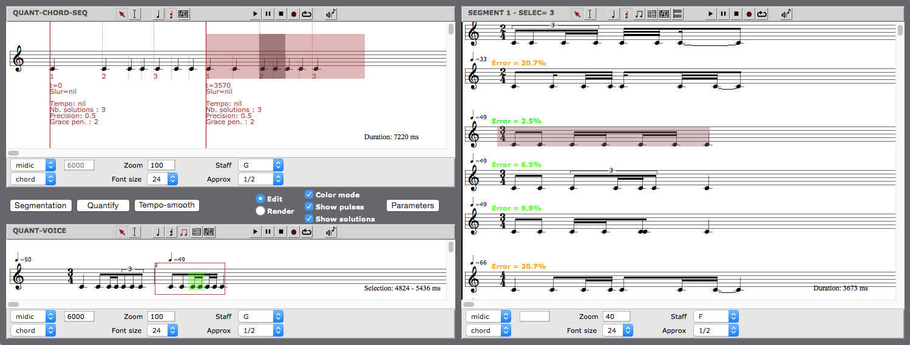

# RQ 
## Supervised approach of rhythm quantification based on tree series enumeration

The RQ library for OM proposes a new interactive approach for rhythm quantification. 
In contrast with previous single-solution systems, RQ runs a graphical interface that allows to visualize and edit the transcriptions of the segmented input sequence.

### The k-best parsing

The quantization algorithm is a recursive, dynamic-programming, lazy algorithm. It works by recursively subdividing segments into equal parts, and then aligning the input points to the closest segment boundary. The algorithm enumerates the subdivisions that give the best results, ranked according to a criterion that combines two quality measures :

- Distance: how close the output is to the input. This distance is given by the sum of the differences between each input point and the point to which it is aligned.
- Complexity: in other words, readability of the output. Complexity takes into account the size of the output rhythm tree, the arities of the tree nodes, and the number of grace notes in the final notation.

### Compatibility 

OpenMusic 6.10 and higher.

### Further reading

The RQ transcription system is described in:

- Adrien Ycart, Florent Jacquemard, Jean Bresson, Slawek Staworko, [Une approche interactive pour la transcription rythmique dans OpenMusic](https://hal.inria.fr/hal-01298806), [JIM 2016](http://jim2016.gmea.net).
- Adrien Ycart, Florent Jacquemard, Jean Bresson, Slawek Staworko, [A Supervised Approach for Rhythm Transcription based on Tree Series Enumeration](https://hal.inria.fr/hal-01315689), [ICMC 2016](http://www.icmc2016.com).

More in-depth description of the algorithm can be found in:
- Adrien Ycart, [Quantification rythmique dans OpenMusic](https://hal.inria.fr/hal-01202257), Master thesis, IRCAM.

The algorithm is based on the algorithms described in: 
 - Liang Huang, David Chiang, [Better k-best parsing](http://www.cis.upenn.edu/~lhuang3/huang-iwpt-correct.pdf), _Proceedings of the Ninth International Workshop on Parsing Technology_. Association for Computational Linguistics.

The segmentation algorithm is described in: 
- A.C. Yang, Elaine Chew, Anja Volk, [A dynamic programming approach to adaptive tatum assignment for rhythm transcription](https://www.researchgate.net/publication/4207863), _Seventh IEEE International Symposium on Multimedia_, 2005.

 More on rhythmic notation, rhythmic quantification and rhythm trees: 
 - http://repmus.ircam.fr/cao/rhythm/

For any inquiries, please contact : adrien[dot]ycart[at]ircam.fr 
